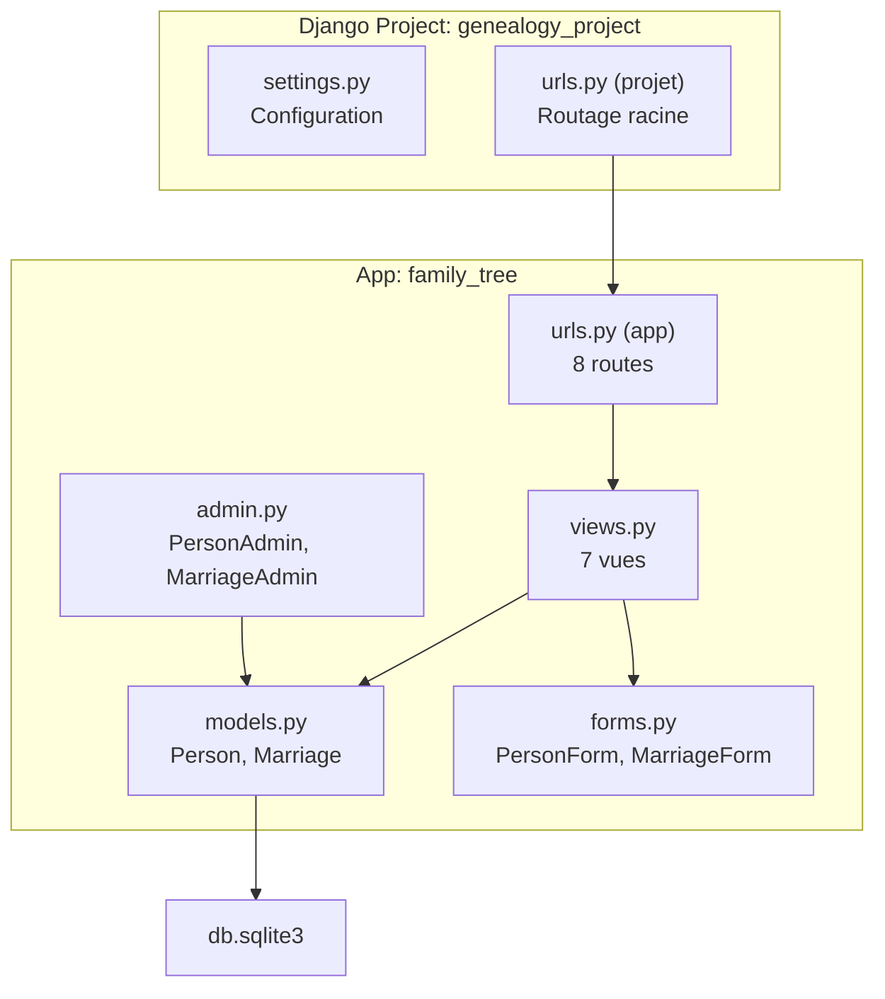
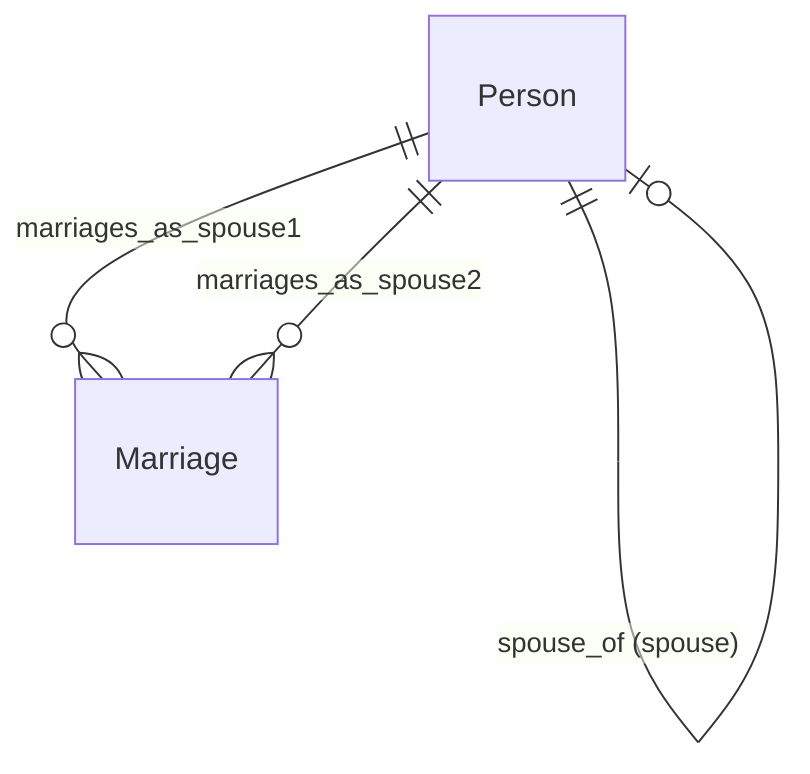
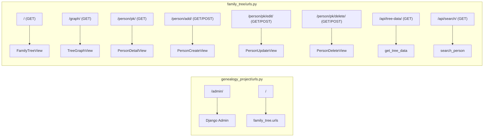

# Logique Backend — Projet Généalogie (Django)

Ce document extrait et documente l'intégralité de la logique backend du projet d'arbre généalogique Django.

---

## 1. Architecture Générale

- **Framework** : Django (Python)
- **BDD** : SQLite3
- **Langue** : `fr-fr`
- **App unique** : `family_tree`

---

## 2. Modèles de Données

### 2.1 `Person` — [`models.py`](family_tree/models.py)

Le modèle central qui représente un membre de la famille.

#### Champs

| Champ | Type | Description |
|---|---|---|
| `first_name` | `CharField(100)` | Prénom |
| `last_name` | `CharField(100)` | Nom de famille |
| `maiden_name` | `CharField(100)` nullable | Nom de jeune fille |
| `gender` | `CharField(1)` | `'M'` (Homme) ou `'F'` (Femme) |
| `birth_date` | `DateField` nullable | Date de naissance |
| `birth_place` | `CharField(200)` | Lieu de naissance |
| `death_date` | `DateField` nullable | Date de décès |
| `death_place` | `CharField(200)` | Lieu de décès |
| `father` | `ForeignKey(self)` | Père — `on_delete=SET_NULL` |
| `mother` | `ForeignKey(self)` | Mère — `on_delete=SET_NULL` |
| `spouse_of` | `ForeignKey(self)` | Conjoint(e) d'un membre de la lignée sanguine |
| `biography` | `TextField` | Biographie |
| `accomplishments` | `TextField` | Accomplissements |
| `profession` | `CharField(200)` | Profession |
| `education` | `TextField` | Formation/Éducation |
| `photo` | `ImageField` | Photo (upload → `media/photos/`) |
| `created_at` | `DateTimeField` | Auto — création |
| `updated_at` | `DateTimeField` | Auto — modification |

#### Relations (auto-référentielles)

#### Propriétés calculées

| Propriété | Logique |
|---|---|
| `full_name` | Si femme avec `maiden_name` → `"Prénom Nom (née NomJeuneFille)"`, sinon `"Prénom Nom"` |
| `is_blood_family` | `True` si `spouse_of is None` (pas un conjoint externe) |
| `is_alive` | `True` si `death_date is None` |
| `age` | Calcule l'âge à partir de `birth_date` jusqu'à `death_date` (ou aujourd'hui si vivant). Gère les mois/jours pour précision. |

#### Méthodes métier

| Méthode | Description |
|---|---|
| `get_children()` | Retourne les enfants selon le genre : filtre par `father=self` (homme) ou `mother=self` (femme) |
| `get_siblings()` | Frères/sœurs = même père OU même mère (union des deux ensembles, `.distinct()`) |
| `get_spouses()` | Trouve les conjoints via les enfants (mères des enfants si homme, pères si femme) |
| `get_children_by_spouse()` | **Logique clé** : groupe les enfants par conjoint. Inclut un groupe `spouse=None` pour les enfants sans 2ème parent identifié. Contient du logging `print()` pour debug. |
| `get_generation()` | Calcul récursif de la génération. `0` = racine (sans parents). Remonte via `father`/`mother` et retourne `max(gen_parent) + 1`. |

> ⚠️ **Attention** : `get_generation()` est récursif sans cache ni limite de profondeur. Sur un arbre très profond, cela peut provoquer des performances dégradées ou un `RecursionError`.

> ℹ️ **Note** : `get_children_by_spouse()` contient de nombreux `print()` de debug qui ne devraient pas être en production.

---

### 2.2 `Marriage` — [`models.py`](family_tree/models.py)

Modèle secondaire pour les mariages officiels.

| Champ | Type | Description |
|---|---|---|
| `spouse1` | `ForeignKey(Person)` | Premier conjoint |
| `spouse2` | `ForeignKey(Person)` | Second conjoint |
| `marriage_date` | `DateField` nullable | Date de mariage |
| `marriage_place` | `CharField(200)` | Lieu de mariage |
| `divorce_date` | `DateField` nullable | Date de divorce |
| `notes` | `TextField` | Notes libres |

---

## 3. Vues (Contrôleurs)

Fichier source : [`views.py`](family_tree/views.py)

### 3.1 Vues basées sur des classes (CBV)

| Vue | Type | URL | Logique |
|---|---|---|---|
| `FamilyTreeView` | `ListView` | `/` | Charge toutes les personnes avec `select_related('father', 'mother')`. Identifie les **racines** = personnes sans parents ET de la lignée sanguine (`spouse_of__isnull=True`). |
| `PersonDetailView` | `DetailView` | `/person/<pk>/` | Enrichit le contexte avec : `children`, `children_by_spouse`, `siblings`, `spouses`. |
| `PersonCreateView` | `CreateView` | `/person/add/` | Supporte le pré-remplissage du parent via `?parent_id=X&parent_gender=M/F`. |
| `PersonUpdateView` | `UpdateView` | `/person/<pk>/edit/` | Modification d'une personne. |
| `PersonDeleteView` | `DeleteView` | `/person/<pk>/delete/` | Suppression avec redirection vers `tree`. |
| `TreeGraphView` | `ListView` | `/graph/` | Similaire à `FamilyTreeView` mais sans filtrer par `spouse_of` pour les racines (inclut **tout le monde**). |

### 3.2 Vues fonctionnelles (API JSON)

#### `get_tree_data()` — `GET /api/tree-data/`

**Endpoint API principal** qui sérialise l'arbre entier en JSON pour le rendu graphique côté client.

Logique détaillée :
1. Charge **toutes** les personnes
2. Pour chaque personne, détermine `is_blood` :
   - A un père OU une mère, **ou**
   - N'a pas de parents mais a des enfants (requête `Q(father=person) | Q(mother=person)`)
3. Appelle `get_children_by_spouse()` pour structurer les enfants
4. Retourne un tableau JSON avec pour chaque personne :
   - `id`, `name`, `gender`, `birth_date`, `death_date`
   - `father_id`, `mother_id`
   - `photo_url`
   - `children_by_spouse` (tableau de `{spouse, children}`)
   - `is_blood`

#### `search_person()` — `GET /api/search/?q=...`

Recherche full-text sur `first_name`, `last_name` et `maiden_name` (insensible à la casse via `__icontains`). Limité à **20 résultats**.

---

## 4. Formulaires

Fichier source : [`forms.py`](family_tree/forms.py)

### `PersonForm`

- Expose 16 champs du modèle `Person`
- **Filtrage intelligent des choix** dans `__init__()` :
  - `father` → seulement les personnes de genre `'M'`
  - `mother` → seulement les personnes de genre `'F'`
  - `spouse_of` → seulement les membres de la lignée sanguine (`spouse_of__isnull=True`)
- Widgets stylisés avec classes CSS `form-input`, `form-select`, `form-textarea`, `form-file`

### `MarriageForm`

- 6 champs : `spouse1`, `spouse2`, `marriage_date`, `marriage_place`, `divorce_date`, `notes`

---

## 5. Administration Django

Fichier source : [`admin.py`](family_tree/admin.py)

### `PersonAdmin`

- **list_display** : nom complet, genre, dates, vivant (icône bool), famille de sang (icône bool), conjoint, père, mère
- **Filtres** : genre, date de naissance, conjoint
- **Recherche** : prénom, nom, nom de jeune fille
- **Hiérarchie de dates** : par date de naissance
- **Fieldsets** organisés en 4 sections (Biographie en mode `collapse`)

### `MarriageAdmin`

- Affichage et recherche standard sur les deux conjoints

---

## 6. Routage URL

Fichiers sources : [`genealogy_project/urls.py`](genealogy_project/urls.py) · [`family_tree/urls.py`](family_tree/urls.py)

---

## 7. Configuration Notable

Fichier source : [`settings.py`](genealogy_project/settings.py)

| Paramètre | Valeur | Remarque |
|---|---|---|
| BDD | SQLite3 | Fichier local `db.sqlite3` |
| DEBUG | `True` | ⚠️ Mode développement |
| SECRET_KEY | Hardcodée | ⚠️ À changer en production |
| ALLOWED_HOSTS | `[]` | ⚠️ À configurer |
| Langue | `fr-fr` | Interface en français |
| Media | `media/` | Photos uploadées |
| Static | `static/` + `staticfiles/` | Fichiers statiques |

---

## 8. Concepts Métier Clés

### Distinction Famille de sang / Conjoints

Le système distingue deux types de personnes :
- **Lignée sanguine** : `spouse_of = None` — les personnes qui font partie de la famille par le sang
- **Conjoints externes** : `spouse_of = <Person>` — les personnes qui ont épousé un membre de la famille

Cette distinction impacte :
- L'affichage des racines de l'arbre (seule la lignée sanguine apparaît comme racine)
- Le filtrage dans le formulaire (`spouse_of` ne propose que les membres sanguins)
- Les indicateurs visuels dans l'admin

### Détermination des relations

Les relations sont déduites **par les enfants communs**, pas par un champ de mariage :
- `get_spouses()` trouve les conjoints en cherchant les co-parents des enfants
- `get_children_by_spouse()` groupe les enfants par l'autre parent

Le modèle `Marriage` existe mais est **optionnel** et indépendant de la logique relationnelle.
